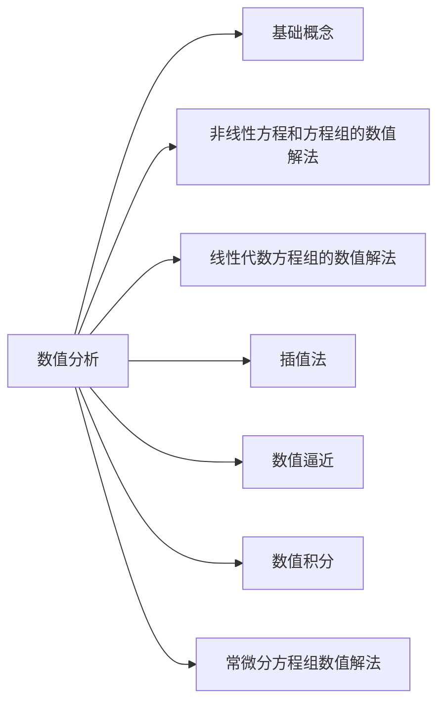

## 资料来源

注意！很多非原创内容

资料来源于：

视频

<https://www.bilibili.com/video/BV1oL411s7EH?p=4&spm_id_from=pageDriver>

书籍：。。。若干而不列举了

本笔记仅供学习。

## 数值分析知识结构

### 数值分析总纲

数值分析就是研究使用数值方法去解决各种问题的学科。

学数值分析，就是学习解决各种问题的数值方法。