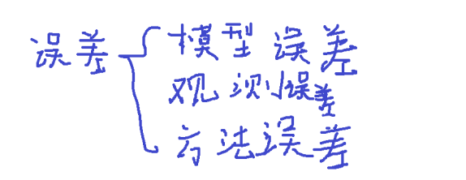

### 误差类型

|误差类型|误差来源|
|-|-|
|方法误差|数值方法解得的数学模型的近似解与数学模型的精确解之间的误差|
|模型误差|数学模型无法精确描述实际模型导致的误差|
|观测误差|因观测手段而造成的误差|

数值分析中的误差分析只关注方法误差（截断误差）。它需要分析和描述精确解与近似解之间的差别

### 近似解和精确解

### 绝对误差和相对误差

### 绝对误差限和相对误差限

### 绝对误差限与有效数字位数